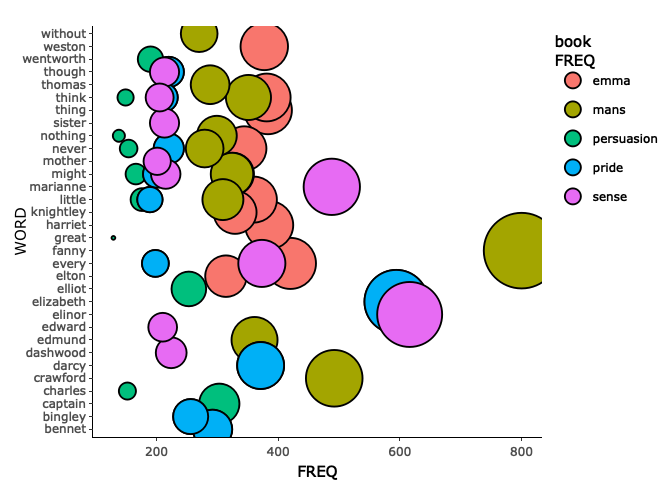
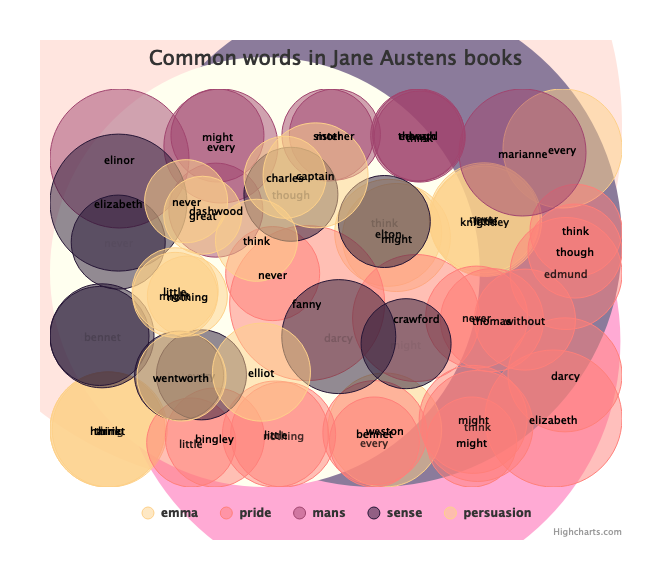

STAT\_545B\_Assingment\_B4
================
Jessica Mukiri
06/12/2021

## Assignment B4: Option A

This is an R Markdown document. Markdown is a simple formatting syntax
for authoring HTML, PDF, and MS Word documents. For more details on
using R Markdown see <http://rmarkdown.rstudio.com>.

When you click the **Knit** button a document will be generated that
includes both content as well as the output of any embedded R code
chunks within the document. You can embed an R code chunk like this:

## Exercise 1 (37.5 points)

Take a Jane Austen book contained in the janeaustenr package,

Make a plot of the most common words in the book, removing “stop words”
of your choosing (words like “the”, “a”, etc.) or stopwords from a
pre-defined source, like the stopwords package or tidytext::stop\_words.

If you use any resources for helping you remove stopwords. name the
source and link to it.

``` r
#packages needed
library(janeaustenr)
library(tidyverse)
```

    ## ── Attaching packages ─────────────────────────────────────── tidyverse 1.3.1 ──

    ## ✓ ggplot2 3.3.5     ✓ purrr   0.3.4
    ## ✓ tibble  3.1.6     ✓ dplyr   1.0.7
    ## ✓ tidyr   1.1.4     ✓ stringr 1.4.0
    ## ✓ readr   2.1.0     ✓ forcats 0.5.1

    ## ── Conflicts ────────────────────────────────────────── tidyverse_conflicts() ──
    ## x dplyr::filter() masks stats::filter()
    ## x dplyr::lag()    masks stats::lag()

``` r
library(ggplot2)
library(stopwords)
library(tm)
```

    ## Loading required package: NLP

    ## 
    ## Attaching package: 'NLP'

    ## The following object is masked from 'package:ggplot2':
    ## 
    ##     annotate

    ## 
    ## Attaching package: 'tm'

    ## The following object is masked from 'package:stopwords':
    ## 
    ##     stopwords

``` r
library(plotly)
```

    ## 
    ## Attaching package: 'plotly'

    ## The following object is masked from 'package:ggplot2':
    ## 
    ##     last_plot

    ## The following object is masked from 'package:stats':
    ## 
    ##     filter

    ## The following object is masked from 'package:graphics':
    ## 
    ##     layout

``` r
library(qdap)
```

    ## Loading required package: qdapDictionaries

    ## Loading required package: qdapRegex

    ## 
    ## Attaching package: 'qdapRegex'

    ## The following object is masked from 'package:dplyr':
    ## 
    ##     explain

    ## The following object is masked from 'package:ggplot2':
    ## 
    ##     %+%

    ## Loading required package: qdapTools

    ## 
    ## Attaching package: 'qdapTools'

    ## The following object is masked from 'package:dplyr':
    ## 
    ##     id

    ## Loading required package: RColorBrewer

    ## 
    ## Attaching package: 'qdap'

    ## The following objects are masked from 'package:tm':
    ## 
    ##     as.DocumentTermMatrix, as.TermDocumentMatrix

    ## The following object is masked from 'package:NLP':
    ## 
    ##     ngrams

    ## The following objects are masked from 'package:base':
    ## 
    ##     Filter, proportions

``` r
library(webshot)
```

# Exercise 3 (37.5 points)

For this exercise, you’ll be evaluating a model that’s fit separately
for each group in some dataset. You should fit these models with some
question in mind.

Examples (do not use these examples):

Maybe your model is a linear model (using lm()) for each country’s life
expectancy over time in the gapminder::gapminder dataset, where you are
interested in each country’s overall trend in life expectancy. Maybe
your model is a distribution of body mass (using the distplyr package)
for each penguin species in the palmerpenguins::penguins dataset, so
that you can produce parametric prediction intervals (such as from a
Normal distribution instead of using the quantile() function) for each
species. Your tasks are as follows.

Make a column of model objects. Do this using the appropriate mapping
function from the purrr package. Note: it’s possible you’ll have to make
use of nesting, here. Evaluate the model in a way that interests you.
But, you should evaluate something other than a single number for each
group. Hint: you’ll need to use another purrr mapping function again.
Print out this intermediate tibble for inspection (perhaps others as
well, if it makes sense to do so). Unnest the resulting calculations,
and print your final tibble to screen. Make sure your tibble makes
sense: column names are appropriate, and you’ve gotten rid of columns
that no longer make sense. Produce a plot communicating something about
the result. Walk a reader through this analysis by providing an
explanation as to what’s going on (in terms of a data analysis question
and results, not necessarily in terms of what’s happening in the code).

``` r
emma1 <- freq_terms( janeaustenr::emma,10, at.least=5, tm::stopwords("english"))%>%  mutate( book = "emma")           

pride1 <- freq_terms( janeaustenr::prideprejudice,10, at.least=5, tm::stopwords("english"))%>%  mutate( book = "pride")

mans1 <-  freq_terms( janeaustenr::mansfieldpark,10, at.least=5, tm::stopwords("english"))%>%  mutate( book = "mans")

sense1 <-  freq_terms( janeaustenr::sensesensibility,10, at.least=5, tm::stopwords("english"))%>%  mutate( book = "sense")

pride1 <- freq_terms( janeaustenr::prideprejudice,10, at.least=5, tm::stopwords("english"))%>%  mutate( book = "pride")

pers1 <- freq_terms( janeaustenr::persuasion,10, at.least=5, tm::stopwords("english"))%>%  mutate( book = "persuasion")


austen1 <- bind_rows(emma1,pride1,mans1,sense1,pride1,pers1)


austen1 <- as_tibble(austen1)


bubplot <- ggplot(austen1, aes(FREQ,WORD,fill= book))+
                 geom_point(aes(size = FREQ), pch = 21)+
                 scale_size_continuous(range = c(1,20))+
                 theme_classic()

bubplot <- ggplotly(bubplot)

bubplot
```

<!-- -->

``` r
#circlepacker 

library(hpackedbubble)
```

    ## 
    ## Attaching package: 'hpackedbubble'

    ## The following object is masked from 'package:datasets':
    ## 
    ##     CO2

``` r
hpackedbubble(austen1$book, austen1$WORD, austen1$FREQ,
              title = "Common words in Jane Austens books",
              pointFormat = "<b>{point.name}:</b> {point.y} words<sub>",
              dataLabelsFilter = 100,
              packedbubbleMinSize = "50%",
              packedbubbleMaxSize = "300%",
              theme = "sunset",
              packedbubbleZMin = 0,
              packedbubbleZmax = 10000, split = 1,
              gravitational = 0.02,
              parentNodeLimit = 1,
              dragBetweenSeries = 0,
              width = "100%")
```

<!-- -->
